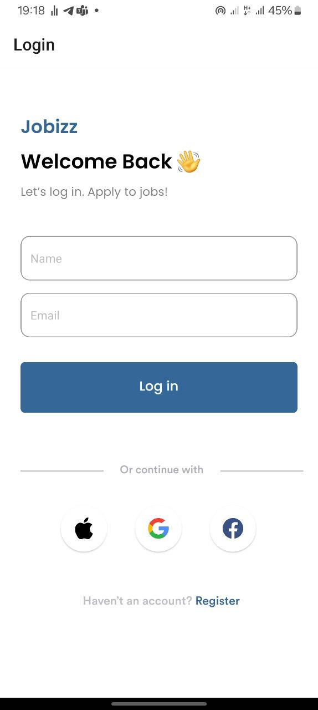
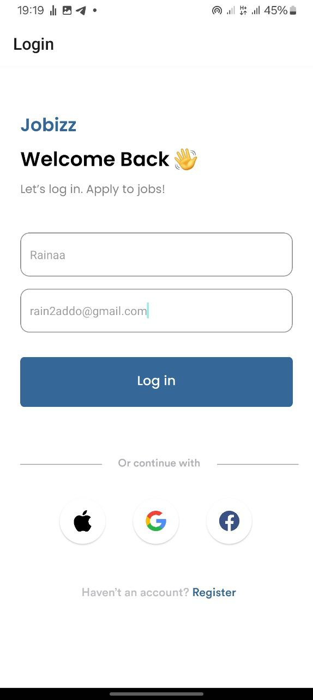
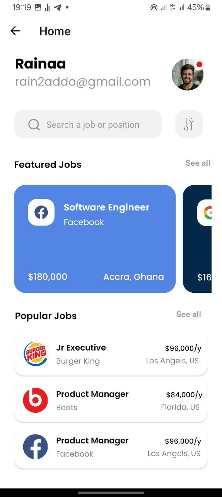
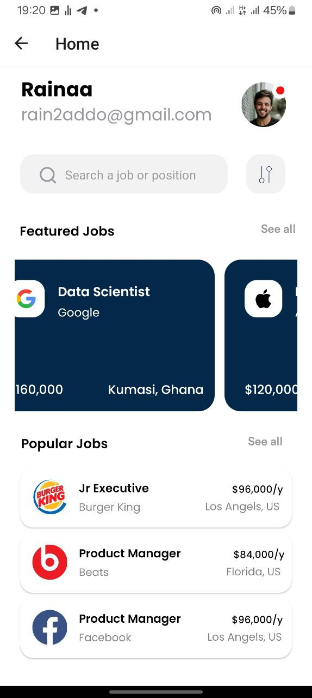
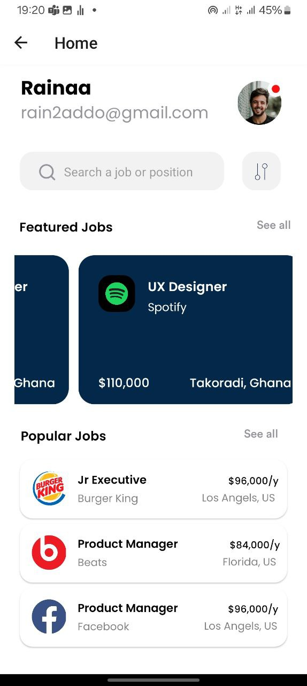
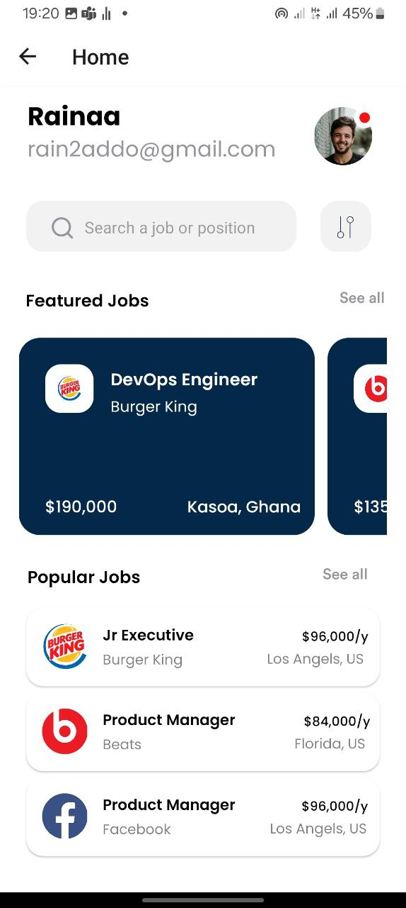
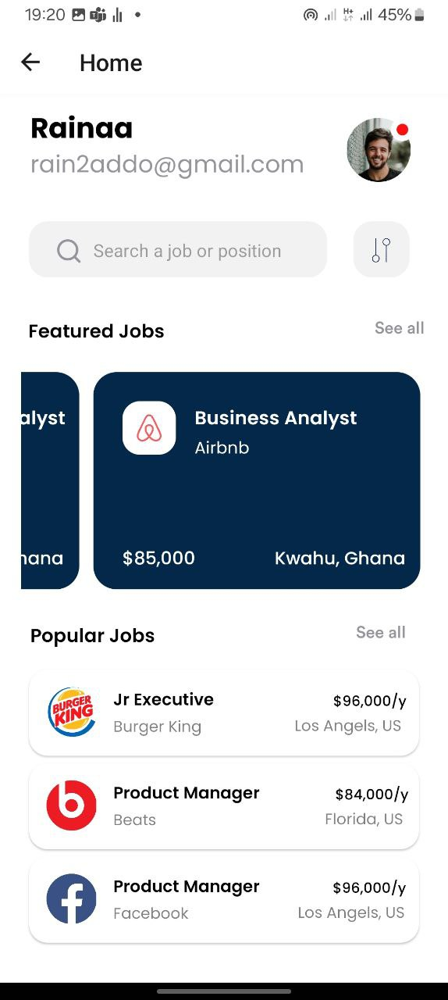

## Jobizz
This project is a React Native Expo application that features two major screens, a login screen and a home screen with various parts, including a user profile section, a job search form, a featured job cards section, and a popular jobs section. The application uses reusable components to display job listings in a clean and organized manner.

## Features
- **Job Listings:** View a list of available job opportunities, including job title, company, and location.
- **Search Functionality:** Search for jobs based on various criteria to find positions that match your interests.

## Components Used in this Project

### LoginScreen
The LoginScreen component is the entry point of the application where users can log in. It includes form fields for name and email details, and a login button. When the login button is pressed, the name and email are passed onto a home page screen, and the user is navigated there. 

### HomeScreen
The HomeScreen component is the main screen or home page of the application. It displays the passed values for the user's name and email, provides a job search form, and lists both featured and popular jobs. The featured jobs are listed in a horizontal scrollview, and are displayed on job cards.

### JobCard
The JobCard component is a reusable component used to display individual job listings, including the job title, job location, job salary and job company. It takes backgroundColor and renderComponent as props to customize the appearance and contents of the job card.

### AppNavigator
The AppNavigator component manages the navigation for the application using the chosen react navigation's stack navigator. It contains two screens: LoginScreen and HomeScreen, with LoginScreen set as the initial route. Therefore, LoginScreen will be the first screen displayed, as it is the entry point of the application.

# Job Search App
This job search app is a frontend-only project built with React Native, providing a user-friendly interface for browsing and applying for job opportunities.

## Screenshots

